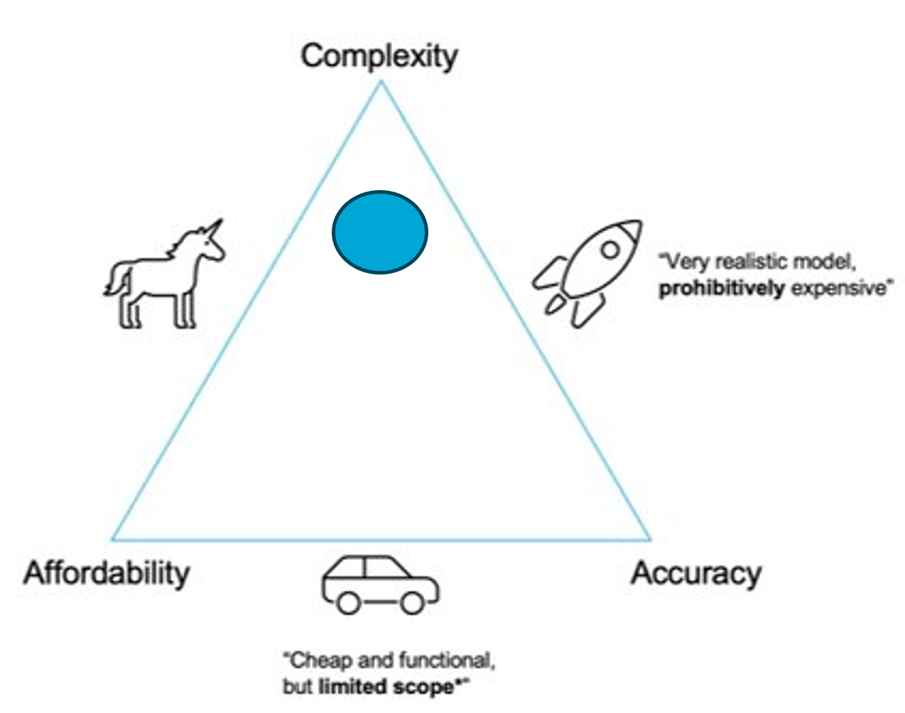
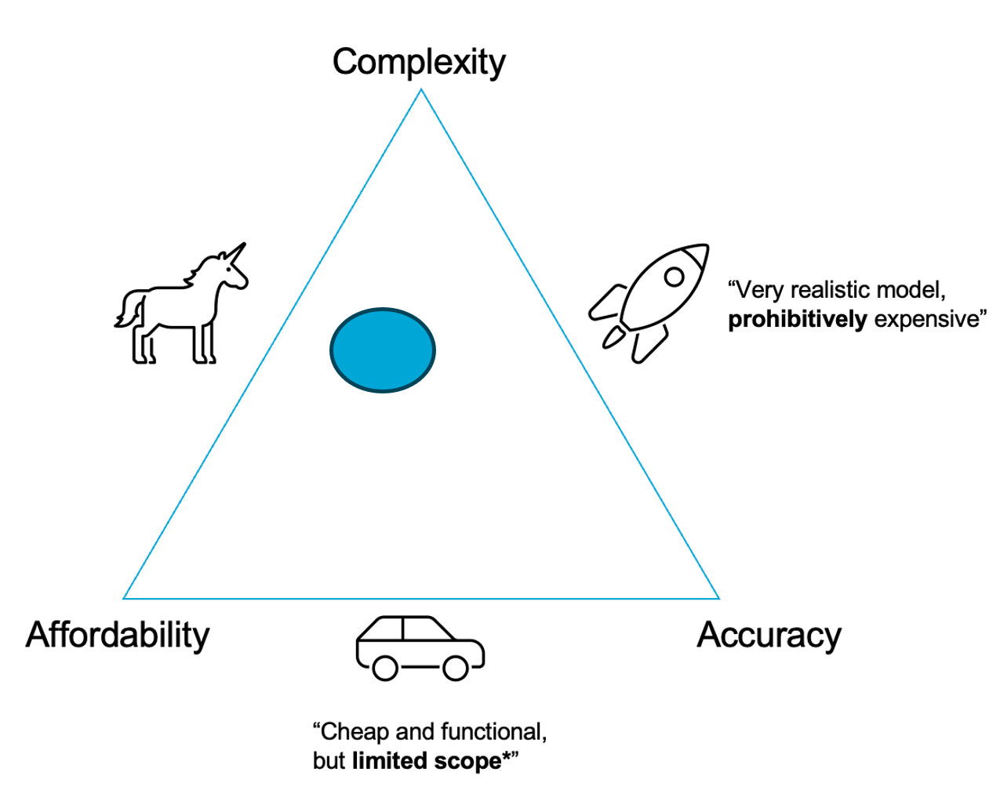
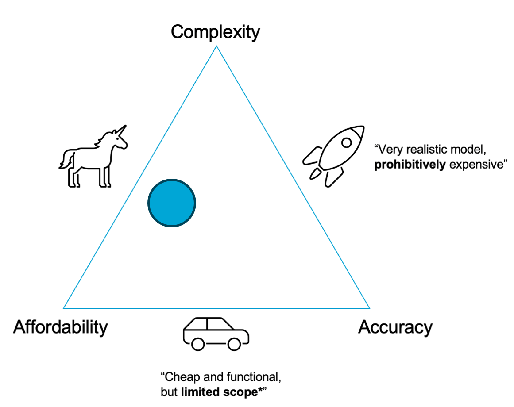
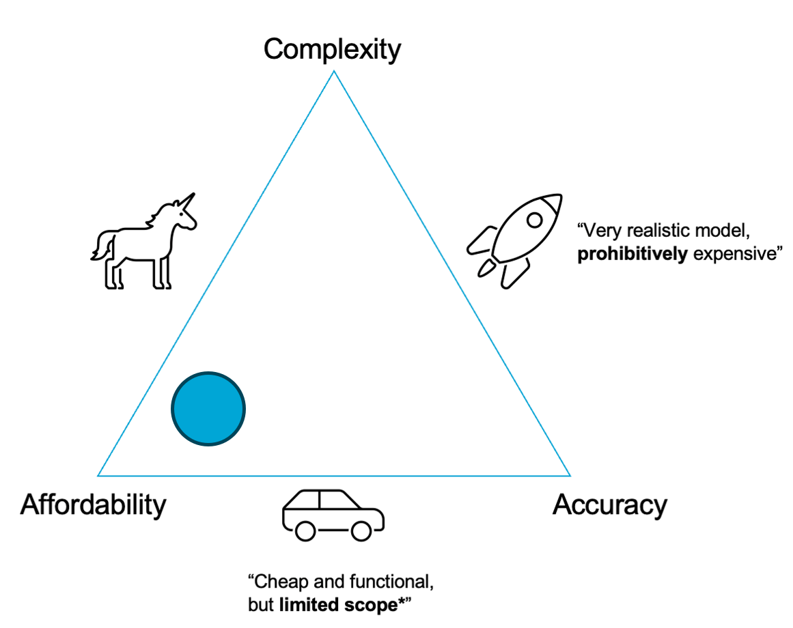

# Report

## Part 1

For part 1, Try splitting into pairs within your group and each choose a model to consider, then after a few minutes regroup and explain your results to each other. Please refer to the book if you are unsure about any terms.

The question below refers to the 4 examples in Part 1 of the notebook.

**1.1 Classify the models in the examples using the categories in the textbook. Please provide an explanation of your choice.**

**1.2 Place each model on the tradeoff triangle (shown below) and provide an explanation of your choice.**

**1.3 What simplifications are made in the models?**

**1.4 What types of uncertainty are the models affected by?**

% solution_start
### Solution to both 1.1 and 1.2, per model:
#### Model 1
Global climate models are mostly phenomenological, based on atmospheric physics and observed data. While they may include some mechanistic parts, accuracy is limited due to the use of grid-based numerical methods like finite element or finite difference. Their complexity is high because of numerical challenges.

- Stochastic elements are sometimes added to handle uncertainty but are often avoided. Instead, many ensemble simulations are run to assess variability.

- Heat exchange is usually modeled phenomenologically—static and deterministic, though mechanistic models like diffusion equations are possible.

- River discharge may be modeled using data or simplified physics, typically ignoring geometry, non-linear, or time-dependent effects.

- Ice melting is generally treated as a static, time-invariant process.

#### Model 2
Solar heat can be modeled deterministically using mechanistic equations, accounting for daily and seasonal cycles. While complex, a stochastic model could simplify this variability.

Snow and ice cover can be estimated from historical data using stochastic or regression models. These are often time-invariant, non-linear, and static, but can feed into mechanistic models to estimate river temperature and ice melting rates, which are typically modeled as deterministic and time-invariant.

River discharge is well-documented and could support more complex, non-linear, and even dynamic models. While ice melting can often be simplified as static (assuming stable temperature), discharge is better modeled dynamically due to rapid changes caused by rain or melting events.

#### Model 3
Discharge and temperature will likely come from data and could be modeled stochastically using probability distributions.

The model for ice melting in the river could be mechanistic (involving ice mass, heat capacity, and water temperature), but is more likely phenomenological—possibly using dimensionless analysis due to complex river geometry.

The rope tension and catenary shape should be modeled mechanistically, and are clearly non-linear. This is likely a static problem, since the load builds slowly as ice melts. However, if there's a sudden surge in river flow or ice breakage, it might become a dynamic impulse load.

#### Model 4
See the solution for Model 3. In this case, a deliberate decision was made to abandon complex mechanistic and phenomenological models for ice deformation. Instead, the model focuses on estimating the probability of reasonable outcomes.

According to the accuracy-complexity-cost triangle, this approach sacrifices some accuracy, but significantly reduces complexity and improves affordability.

% solution_end

**1.3 Which model of the examples do you think would be the most useful for winning the Ice Classic? Provide an explanation of your choice.**

% solution_start

"There is not a definitive answer otherwise we wouldn't be here now."* A. Stamou, MUDE TA, Delft

It is difficult to say without seeing more details about the model, quality of the data etc. 
The answer is often subjective and depends on your assumptions and perspective. 

% solution_end

## Part 2

Before answering these questions, please work through Part 2 of the notebook.

**2.1 Provide a description of the resulting models for model 1 and model 2. What do you observe?e? Are they accurate?**

% solution_start
`<solution>`
% solution_end

**2.2 Which model, if any, do you think is better according to Goodness of Fit metrics? Why?**

## Part 3

**3.1 Have a look at the given examples and papers in part 3. What assumption and simplifications do you make? What do you think the tradeoffs are?**

**3.2 How do the different types of uncertainty appear in these models?**

**3.3 (Optional but recommended) Based on these models and the data you have available, make a prediction for the ice breakup for next year!**

% solution_start
There is a huge variety of answers, so only a brief outline will be illustrated here.
Most groups recognized the importance of discharge and ice thickness and found really interesting ways to connect observable variables to these, which are at the core of the prediction model. Some were more complex than others, and ranged in scale from global to regional, but all incorporated interesting aspects of hydrology, climate, weather, etc (solar radiation, for example, was a nice one, as it has complex relationship with snow/ice melting, both on the river and upstream in the watershed).
Some key points to keep in mind/recognize:
Ideally one would “observe” the discharge and ice thickness at breakup to identify a critical threshold of discharge that may cause the ice to break, given the current ice thickness (i.e., critical discharge increases with increasing ice thickness). This is a great idea; however, it is much more difficult to do in practice:
It is impossible to measure ice thickness during breakup: check out this video to understand why. Also, at some point before breakup occurs it becomes unsafe to measure the ice thickness. You can get around this issue by using the Ashton model to estimate ice thickness (extrapolate from last measurements)
There will be “scatter” in the relationship between discharge and ice thickness, it is not a perfect 1:1 relationship
To make the bet, we are making a prediction (extrapolating). We need to predict discharge and thickness, both of which are heavily dependent on weather, which is very difficult to predict accurately, especially when we need to look several weeks in advance! This makes the ice classic a very challenging (but interesting) modelling problem.
% solution_end

**3.3 (Optional but recommended) Outline your own conceptual model based on what you have learned in the notebook. Explain your choices.**

% solution_start
This one is up to you :)
% solution_end

> Jialei Ding and Robert Lanzafame, Delft University of Technology. CC BY 4.0, more info [on the Credits page of Workbook](https://mude.citg.tudelft.nl/workbook-2025/credits.html).
